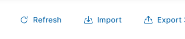
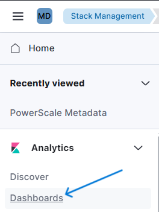

# Overview

This repository contains an example Kibana dashboard to be used with a Dell PowerScale cluster. The panels in the dashboard are designed to showcase some of the capabilities of the MetadataIQ feature introduced in OneFS 9.10. These examples should be used as a reference to build your own panels or queries. The methods used to build the panels are not necessarily optimal and may not be appropriate for very large data sets in the billions of documents.

The dashboard consists of 2 ndjson files that represent individual Kibana panels and the dashboard itself. In addition to the dashboard and panel ndjson files, a Kibana ingest pipeline and extra index template are required to be created for the examples in this repository to function.

The dashboard has been translated into several languages. In the *dashboard* directory the panel and dashboard files have a 2 letter language code prefix. The current languages, and 2 letter code, available are:

- English (en)

- German (de)

- Japanese (ja)

- Korean (ko)

# Installation

It is recommended that when using the example dashboard, the ingest pipeline and index template are created before you start uploading documents into your Elastic Search cluster. If this is not done some of the panels will not have the correct additional fields that the ingest pipeline provides.

The first decision that needs to be made is which Kibana space you want to insert the dashboard into. For the purposes of this example, it will be assumed that you have created a new Kibana spaced named **Metadata Demo** already and that you have changed into this new space.

The steps to commplete the install are as follows:

1. Adding ingest pipeline and index template

2. Import dashboard panels and dashboard

## Adding ingest pipeline and index template

There are 2 files in the kibana_commands directory that contain the API calls required to create the ingest pipeline and the index template.

The 2 files are named:

- ingest_pipeline.console

- index_template.console

You are free to send these commands to your Kibana instance in any way you would like. For these instructions we will use the build in developer tools.

The first step is to open up the Dev Tools page in Kibana.

Open the **Menu** in Kibana and then select the **Dev Tools** option under the **Management** section.

In the **Dev Tools** console, scroll down to an empty area, and paste in the contents of the *ingest_pipeline.console* file into the console as shown below. If there are no empty lines, click at the end and hit Enter several times to create new, empty lines.

Run the command by clicking somewhere on the PUT line, line 26 in this example, and then clicking the Play/Execute button to send the request.

The right hand side of the screen should return a **200 OK** response.

In the left hand console panel, scroll down to find empty lines. You can create empty lines by clicking at the end and pressing Enter several times. Paste in the contents of the *index_template.console* file.

Run the command by clicking somwhere on the PUT line, line 84 in this example, and then clicking the Play/Execute button to send the request.

The right hand side of the screen should return a **200 OK** response.

## Import dashboard panels and dashboard

After creating the ingest pipeline and index template, the next step is to import the dashboard panels. In the *dashboard* directory both the panels and the dashboard ndjson files are present. There files are available in several languages. Choose the appropriate language based on the 2 letter language code at the beginning of each of the files. In this example we will be importing the English version of the dashboard.

The first step is to open up the **Stack Management** page.

Open the **Menu** in Kibana and then select the **Stack Management** option under the **Management** section.

Next, select the **Saved Objects** option under the **Kibana** section.

Click on the **Import** button to open up a dialogue box allowing you to select a file to import.

You can either drag and drop the *en-panels.ndjson* file or click on the **Import** icon and use a file selection dialogue. Select the *en-panels.ndjson* file at this time.

Once the file has been selected, make sure to have the **Automatically overwrite conflicts** option set and then click on the **Import** button.

If the import is successful, you will see a confirmation screen similar to the one above.

Next we will be importing the dashboard that utilizes the panels.

Click on the **Import** button to open up a dialogue box allowing you to select a file to import.

You can either drag and drop the *en-dashboard.ndjson* file or click on the **Import** icon and use a file selection dialogue. Select the *en-dashboard.ndjson* file at this time.

Once the file has been selected, make sure to have the **Automatically overwrite conflicts** option set and then click on the **Import** button.

If the import is successful, you will see a confirmation screen similar to the one above.

This concludes the steps required to install the Kibana dashboards.

# Viewing the dashboard

To view the dashboard, click on the **Dashboards** option under the **Analytics** section.

# Panel customization

Many of the panels in the dashboard are general and should be usable without customization. There are several panel types that could use customization. This section details these panels and a method on how to update them within the Kibana UI.

The panel types that will often require customization:

- Size histogram

- Date histogram

- File category

- Path based

There are several methods to modify the panels themselves. In the exmples below, the panels are modified through the dashboard itself using the edit mode.

To enter the edit mode click on the **Edit** button in the uper right corner of the dashboard.

To edit a specific panel, click on the 3 dots in the upper right corner of a panel.

Then click on **Edit Visualization** in the context menu.

## Size histogram

The file size histograms can be modified to suit your own needs. After selecting the **Edit Visualization** option in the panel's context menu, a screen similar to the one below will be available. To change the size ranges or the number of ranges, select the **data.size** option in the **Vertical axis** section.

A new window will appear with the configured ranges. A new range can be added by clicking on the **Add range** option at the bottom. Entries can be re-arranged by click and holding the 2 horizontal bars on the left of each entry and using your mouse to move them around.

When you click on an individual entry, you can modify the byte range used in that entry. The inequality used is of the form A <= X < B. Where A is the lower limit and B is the upper limit. In the example panels, we like to have base 2 rounded values for the upper bound. Because the upper bound is a strictly less than comparison, we take the rounded base 2 number and add 1. For the lower bound, the comparison is a greater than or equal so we also add 1 to the lower boundary.

You should adjust the label to represent the correct range. The label is not automatically generated.

## Date histogram

The date based histograms can be modified to suit your own needs. After selecting the **Edit Visualization** option in the panel's context menu, a screen similar to the one below will be available. To change the size ranges or the number of ranges, select the **Filters** option in the **Vertical axis** section.

Similar to the size histogram panel, a list of date ranges will be displayed after clicking on **Filters**. When you select an individual filter, you can alter the date range for that particular entry to suit your needs.

## File category

## Path based

There are several panels that use a path as a filter. These paths must be manually modified to fit your environment. All the paths in the example dashboard are just place holder paths and these should be adjusted for your environment.

After selecting the **Edit Visualization** option in the panel's context menu, a screen similar to the one below will be available. To change the size ranges or the number of ranges, select the **Path** option in the **Vertical axis** section.

A list of path filters will be presented in a list. Additional paths can be added by clicking on the **Add filter** option at the bottom.

When selecting a specific path, the filter used needs to be in the format shown below. The field name followed by the actual path for the filter.

e.g. data.file.path: "<some_directory>"

The path should be enclosed in quotes and it should end with a trailing back slash. The path must start with "/ifs" as all paths in the MetadataIQ index are full paths. Your label needs to be manually set. Using the actual path is advisable but another more useful label could be used instead.

# Contribution

Want to contribute? Comments, suggestions, or translation help is appreciated. Open an issue or submit a pull request.

# License

[**MIT**](LICENSE)
